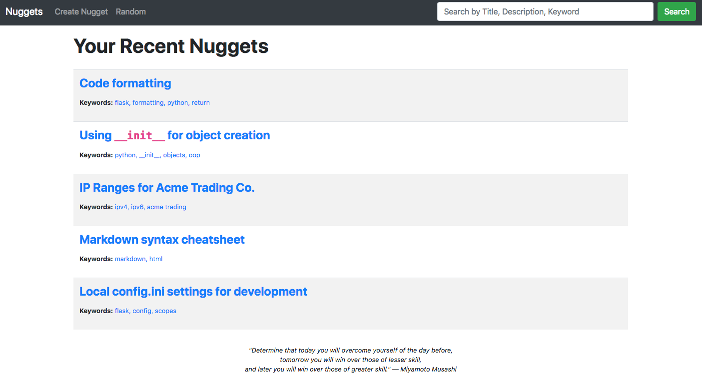

Nuggets
=======

.. highlight: python

.. image:: https://img.shields.io/github/license/Naereen/StrapDown.js.svg
   :target: https://github.com/Naereen/StrapDown.js/blob/master/LICENSE

A Flask/MongoDB application that stores small bits of information (nuggets) organized by keywords.

Nuggets was created to serve as a lightweight application that you can use to store information that you need to remember. Code samples, infrastructure details, to-do lists, etc.

Requirements
============

I promise I will get all of this into a setup file soon. For now, you're going to need the following dependencies installed:

* Flask
* Flask_WTF
* MongoDB
* Flask_PyMongo

Running Nuggets
===============

* Start up mongo in a terminal using the command: ``mongo``
* Start the Nuggets Flask application in another terminal using the command: ``FLASK_APP=nuggets FLASK_DEBUG=True flask run --port=5050``
* Once running, open a browser window and navigate to: ``http://localhost:5050``
* Have fun!

Usage
=====

Nuggets is quite straightforward. Use the *Create Nugget* link in the header when you want to add a new piece of information. The `Description`
field uses standard Markdown syntax. The only "gotcha" is related to code syntax and highlighting. In order to get true code output, I suggest you
manually use the <pre><code>xxx</code></pre> syntax instead of the three-backtick approach. This is due to a quirk with markdown/HTML rendering, and
allows Nuggets to benefit from use of the `highlight.js <https://highlightjs.org>` code formatting library.

I also included a *Random* link in the header, just for the heck of it. Click on the link and it will return an random Nugget.

.. image:: nuggets-002.png

TODO
====

* Pagination to all results lists
* init cleanup
* backup MongoDB
* Start script that will auto-start MongoDB and the Flask application
* Delete a Nugget via Javascript "confirm" action
* Submit to PyPI?
